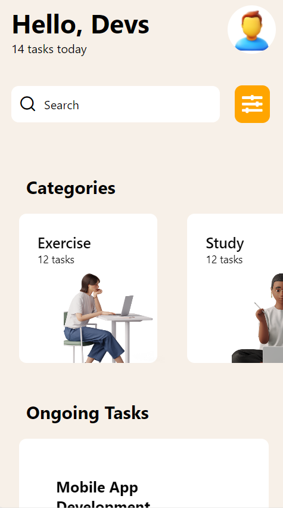

# rn-assignment3-11252890

## Components Used

* View: The 'View' component serves as a container that supports flexbox layout, and style

* Button: The 'Button' component is used to create a clickable button

* ScrollView: It is a component that provides a scrolling container that can hold multiple views or components

* TextInput: it allows the user to enter text.

* Text: a component for displaying text

* FlatList: The FlatList is a component used for rendering a list of items

* Image: The Image component is used for diaplaying images

* Stylesheet: a module used for creating a style object that can be used with components. It is used to style components components created

## Screenshots

